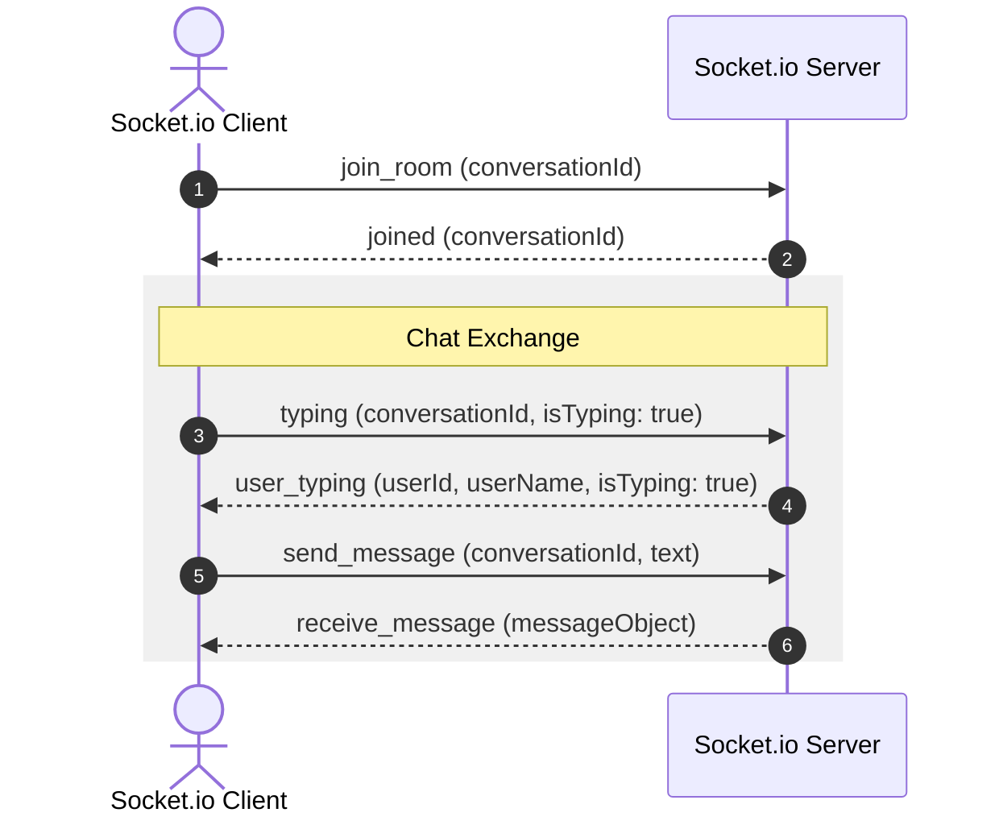

# Lumina Learning Management System: Complete API Documentation

Welcome! This is the complete, single-source-of-truth developer handbook for consuming the **Lumina Real-Time Learning Platform** backend APIs.

It details:
1. **REST Endpoints** (Authentication, Courses, Lessons, Enrollments, Progress, Chat, Payments, Instructor Analytics, Admin Panel).
2. **Socket.io WebSocket Interface** (Connection handshake, group room chat, DMs, live typing indicators, and payment notifications).

---

## 🔑 Authentication & Headers
Except for public routes, every REST request must include a JSON Web Token (JWT) in the `Authorization` header:

```http
Authorization: Bearer <your_jwt_token>
```

---

## 🗺️ REST API Index

```
Lumina Backend API (/api)
 ├── /auth
 │    ├── POST  /register                     -> Register account
 │    ├── POST  /login                        -> Login account
 │    └── PATCH /switch-to-instructor         -> Elevate current user to Instructor
 ├── /courses
 │    ├── POST  /                             -> Create course (Instructor only)
 │    ├── PATCH /:id                          -> Update course (Instructor/Admin)
 │    ├── GET   /                             -> Fetch all courses
 │    └── GET   /:id                          -> Fetch specific course & lessons list
 ├── /lessons
 │    ├── POST  /                             -> Create lesson (Instructor only)
 │    ├── PATCH /:id                          -> Update lesson (Instructor/Admin)
 │    └── GET   /course/:courseId             -> Fetch lessons for a course
 ├── /enroll
 │    ├── POST  /:courseId                    -> Enroll directly (Bypass for FREE courses only)
 │    ├── PATCH /progress/:lessonId           -> Toggle completion progress (Private)
 │    └── GET   /my                           -> Get student's enrolled courses
 ├── /chat
 │    ├── GET   /conversations                -> Get user's conversation list (Rooms + DMs)
 │    ├── GET   /course/:courseId             -> Get chat room ID for a specific course
 │    ├── GET   /history/:conversationId      -> Fetch paginated chat history (reversed chronological)
 │    ├── POST  /conversation                 -> Start/retrieve a direct message (DM) conversation
 │    └── POST  /message                      -> Send fallback REST message (emits to socket room)
 ├── /payments
 │    ├── POST  /checkout                     -> Purchase course (Free enrolls directly, paid yields Paystack gateway)
 │    └── POST  /webhook                      -> Paystack success webhook (Public, HMAC-verified)
 ├── /instructor
 │    ├── POST  /profile/bank-details         -> Register payout bank details (Paystack Subaccount)
 │    └── GET   /dashboard/stats              -> Payout aggregates & sales histories
 └── /admin
      ├── POST  /setup                        -> Create initial admin (Public/Local setup only)
      ├── POST  /login                        -> Admin-specific login gateway
      ├── GET   /stats                        -> System statistics
      ├── GET   /users                        -> Fetch all registered users
      ├── DELETE/users/:userId                -> Delete user from registry
      ├── GET   /courses                      -> Fetch all course nodes
      ├── DELETE/courses/:courseId            -> Delete course node
      └── PATCH /make-admin/:userId           -> Elevate user to administrator status
```

---

## 🔒 1. User Authentication API (`/api/auth`)

### 1.1 Register Account
Creates a new student or instructor.
* **URL:** `/api/auth/register`
* **Method:** `POST`
* **Auth Guard:** None (Public)

#### Request Body
```json
{
  "name": "Jane Student",
  "email": "jane@example.com",
  "password": "securepassword123",
  "role": "student"
}
```
*Note: Valid roles are `"student"` or `"instructor"`. Attempting to register as `"admin"` defaults to `"student"`.*

#### Success Response (`201 Created`)
```json
{
  "status": "success",
  "data": {
    "id": "e30c451b-1a98-4c12-9214-a9fae8a719d3",
    "name": "Jane Student",
    "email": "jane@example.com",
    "role": "student",
    "token": "eyJhbGciOiJIUzI1NiIsInR5cCI6IkpXVCJ9..."
  }
}
```

---

### 1.2 Login Account
* **URL:** `/api/auth/login`
* **Method:** `POST`
* **Auth Guard:** None (Public)

#### Request Body
```json
{
  "email": "jane@example.com",
  "password": "securepassword123"
}
```

#### Success Response (`200 OK`)
```json
{
  "status": "success",
  "data": {
    "id": "e30c451b-1a98-4c12-9214-a9fae8a719d3",
    "name": "Jane Student",
    "email": "jane@example.com",
    "role": "student",
    "token": "eyJhbGciOiJIUzI1NiIsInR5cCI6IkpXVCJ9..."
  }
}
```

---

### 1.3 Elevate Role to Instructor
Promotes the logged-in student to an instructor.
* **URL:** `/api/auth/switch-to-instructor`
* **Method:** `PATCH`
* **Auth Guard:** Private (Requires Student token)

#### Success Response (`200 OK`)
```json
{
  "status": "success",
  "message": "Successfully switched to instructor",
  "data": {
    "id": "e30c451b-1a98-4c12-9214-a9fae8a719d3",
    "name": "Jane Student",
    "email": "jane@example.com",
    "role": "instructor"
  }
}
```

---

## 📚 2. Course Management API (`/api/courses`)

### 2.1 Create a Course
* **URL:** `/api/courses/`
* **Method:** `POST`
* **Auth Guard:** Private (Requires Instructor/Admin token)

#### Request Body
```json
{
  "title": "Fullstack Node.js and Express Course",
  "description": "Learn backend development in modern Node.js.",
  "category": "Software Engineering",
  "thumbnail_url": "https://cdn.example.com/node-thumb.png",
  "price": 15000.00,
  "currency": "NGN"
}
```
*Note: `price` defaults to `0.00` (Free), and `currency` defaults to `"NGN"`.*

#### Success Response (`201 Created`)
```json
{
  "status": "success",
  "data": {
    "id": "c10d34e9-fc12-44df-91ea-d2f62cbfa8a9",
    "instructor_id": "e30c451b-1a98-4c12-9214-a9fae8a719d3",
    "title": "Fullstack Node.js and Express Course",
    "description": "Learn backend development in modern Node.js.",
    "category": "Software Engineering",
    "thumbnail_url": "https://cdn.example.com/node-thumb.png",
    "price": 15000.00,
    "currency": "NGN",
    "createdAt": "2026-05-19T11:00:00.000Z",
    "updatedAt": "2026-05-19T11:00:00.000Z"
  }
}
```

---

### 2.2 Get All Courses
Fetches all active courses across the platform. Includes the instructor's coordinates.
* **URL:** `/api/courses/`
* **Method:** `GET`
* **Auth Guard:** Private (Requires Student/Instructor/Admin token)

#### Success Response (`200 OK`)
```json
{
  "status": "success",
  "data": [
    {
      "id": "c10d34e9-fc12-44df-91ea-d2f62cbfa8a9",
      "instructor_id": "e30c451b-1a98-4c12-9214-a9fae8a719d3",
      "title": "Fullstack Node.js and Express Course",
      "description": "Learn backend development in modern Node.js.",
      "category": "Software Engineering",
      "thumbnail_url": "https://cdn.example.com/node-thumb.png",
      "price": 15000.00,
      "currency": "NGN",
      "Instructor": {
        "id": "e30c451b-1a98-4c12-9214-a9fae8a719d3",
        "name": "Jane Instructor",
        "email": "jane@example.com"
      }
    }
  ]
}
```

---

### 2.3 Get Specific Course by ID
Fetches details of a specific course, including sorted lessons hierarchy.
* **URL:** `/api/courses/:id`
* **Method:** `GET`
* **Auth Guard:** Private (Requires token)

#### Success Response (`200 OK`)
```json
{
  "status": "success",
  "data": {
    "id": "c10d34e9-fc12-44df-91ea-d2f62cbfa8a9",
    "title": "Fullstack Node.js and Express Course",
    "description": "Learn backend development in modern Node.js.",
    "category": "Software Engineering",
    "thumbnail_url": "https://cdn.example.com/node-thumb.png",
    "price": 15000.00,
    "currency": "NGN",
    "Instructor": {
      "id": "e30c451b-1a98-4c12-9214-a9fae8a719d3",
      "name": "Jane Instructor",
      "email": "jane@example.com"
    },
    "lessons": [
      {
        "id": "l91d34fa-ab98-42df-b7ea-09facbfa81bc",
        "title": "Lesson 1: Introduction to Node.js",
        "order_index": 1
      }
    ]
  }
}
```

---

### 2.4 Update Course
* **URL:** `/api/courses/:id`
* **Method:** `PATCH`
* **Auth Guard:** Private (Requires Course Owner or Administrator token)

#### Request Body
```json
{
  "title": "Updated Node.js Masterclass",
  "price": 18000.00
}
```

#### Success Response (`200 OK`)
```json
{
  "status": "success",
  "data": {
    "id": "c10d34e9-fc12-44df-91ea-d2f62cbfa8a9",
    "title": "Updated Node.js Masterclass",
    "description": "Learn backend development in modern Node.js.",
    "category": "Software Engineering",
    "thumbnail_url": "https://cdn.example.com/node-thumb.png",
    "price": 18000.00,
    "currency": "NGN"
  }
}
```

---

## 📖 3. Lesson Management API (`/api/lessons`)

### 3.1 Create a Lesson
* **URL:** `/api/lessons/`
* **Method:** `POST`
* **Auth Guard:** Private (Requires Instructor/Admin token)

#### Request Body
```json
{
  "course_id": "c10d34e9-fc12-44df-91ea-d2f62cbfa8a9",
  "title": "Lesson 2: Express routing models",
  "content": "Deep dive into Express routes and middleware chain configurations...",
  "video_url": "https://vimeo.com/example/lesson-2-key",
  "order_index": 2
}
```

#### Success Response (`201 Created`)
```json
{
  "status": "success",
  "data": {
    "id": "l92d45fa-bb28-42df-a7eb-09facefa82bc",
    "course_id": "c10d34e9-fc12-44df-91ea-d2f62cbfa8a9",
    "title": "Lesson 2: Express routing models",
    "content": "Deep dive into Express routes and middleware chain configurations...",
    "video_url": "https://vimeo.com/example/lesson-2-key",
    "order_index": 2
  }
}
```

---

### 3.2 Update Lesson
* **URL:** `/api/lessons/:id`
* **Method:** `PATCH`
* **Auth Guard:** Private (Requires Instructor/Admin token)

#### Request Body
```json
{
  "title": "Lesson 2: Advanced routing patterns",
  "order_index": 3
}
```

#### Success Response (`200 OK`)
```json
{
  "status": "success",
  "data": {
    "id": "l92d45fa-bb28-42df-a7eb-09facefa82bc",
    "course_id": "c10d34e9-fc12-44df-91ea-d2f62cbfa8a9",
    "title": "Lesson 2: Advanced routing patterns",
    "content": "Deep dive into Express routes...",
    "video_url": "https://vimeo.com/example/lesson-2-key",
    "order_index": 3
  }
}
```

---

### 3.3 Get Course Lessons
Fetches all lessons inside a specific course, sorted sequentially by `order_index`.
* **URL:** `/api/lessons/course/:courseId`
* **Method:** `GET`
* **Auth Guard:** Private (Requires token)

#### Success Response (`200 OK`)
```json
{
  "status": "success",
  "data": [
    {
      "id": "l91d34fa-ab98-42df-b7ea-09facbfa81bc",
      "course_id": "c10d34e9-fc12-44df-91ea-d2f62cbfa8a9",
      "title": "Lesson 1: Introduction to Node.js",
      "order_index": 1
    },
    {
      "id": "l92d45fa-bb28-42df-a7eb-09facefa82bc",
      "course_id": "c10d34e9-fc12-44df-91ea-d2f62cbfa8a9",
      "title": "Lesson 2: Advanced routing patterns",
      "order_index": 3
    }
  ]
}
```

---

## 📈 4. Student Enrollments & Progress API (`/api/enroll`)

### 4.1 Enroll Directly in Course (FREE Courses ONLY)
Registers a student directly into a **free** course (price = 0).
* **URL:** `/api/enroll/:courseId`
* **Method:** `POST`
* **Auth Guard:** Private (Requires Student token)

> [!CAUTION]
> **Constraint:** If this endpoint is called with the ID of a paid course (price > 0), the request is rejected with a `400 Bad Request` code. Paid courses must be registered via the `/api/payments/checkout` gateway.

#### Success Response (`210 Created`)
```json
{
  "status": "success",
  "message": "Successfully enrolled in course",
  "data": {
    "id": "ab9c34e8-f9d2-45e3-8419-74dca7fa281c",
    "user_id": "e30c451b-1a98-4c12-9214-a9fae8a719d3",
    "course_id": "c10d34e9-fc12-44df-91ea-d2f62cbfa8a9",
    "completed_lesson_ids": []
  }
}
```

#### Error Response: Paid Course (`400 Bad Request`)
```json
{
  "status": "error",
  "message": "This is a paid course. Please use the checkout endpoint to purchase and enroll in this course."
}
```

---

### 4.2 Toggle Lesson Progress
Marks a lesson as complete or incomplete, calculating the user's progress percentage dynamically.
* **URL:** `/api/enroll/progress/:lessonId`
* **Method:** `PATCH`
* **Auth Guard:** Private (Requires Student token)

#### Success Response (`200 OK`)
```json
{
  "status": "success",
  "message": "Lesson marked as complete",
  "data": {
    "completed_lesson_ids": [
      "l91d34fa-ab98-42df-b7ea-09facbfa81bc"
    ],
    "progress": 50
  }
}
```

---

### 4.3 Get Student's Enrolled Courses
* **URL:** `/api/enroll/my`
* **Method:** `GET`
* **Auth Guard:** Private (Requires Student token)

#### Success Response (`200 OK`)
```json
{
  "status": "success",
  "data": [
    {
      "id": "ab9c34e8-f9d2-45e3-8419-74dca7fa281c",
      "user_id": "e30c451b-1a98-4c12-9214-a9fae8a719d3",
      "course_id": "c10d34e9-fc12-44df-91ea-d2f62cbfa8a9",
      "completed_lesson_ids": ["l91d34fa-ab98-42df-b7ea-09facbfa81bc"],
      "course": {
        "id": "c10d34e9-fc12-44df-91ea-d2f62cbfa8a9",
        "title": "Fullstack Node.js and Express Course",
        "description": "Learn backend development...",
        "thumbnail_url": "https://cdn.example.com/node-thumb.png"
      }
    }
  ]
}
```

---

## 💬 5. Chat & Communication API (`/api/chat`)

### 5.1 Get Conversations
Returns the active rooms (courses the user is enrolled in or instructing) and active Direct Messages (DMs).
* **URL:** `/api/chat/conversations`
* **Method:** `GET`
* **Auth Guard:** Private (Requires token)

#### Success Response (`200 OK`)
```json
{
  "status": "success",
  "data": {
    "courseRooms": [
      {
        "id": "rm91c34e-f823-45ab-8219-c1facbfe71ba",
        "type": "room",
        "course_id": "c10d34e9-fc12-44df-91ea-d2f62cbfa8a9",
        "participants": [],
        "course": {
          "id": "c10d34e9-fc12-44df-91ea-d2f62cbfa8a9",
          "title": "Fullstack Node.js and Express Course",
          "thumbnail_url": "https://cdn.example.com/node-thumb.png"
        }
      }
    ],
    "dms": [
      {
        "id": "dm82a12d-a12b-34cd-1234-71fa8cbca123",
        "type": "dm",
        "participants": [
          "e30c451b-1a98-4c12-9214-a9fae8a719d3",
          "f8d123ab-89c0-12de-f456-78abcd123456"
        ]
      }
    ]
  }
}
```

---

### 5.2 Get Course Chat Room ID
Finds or generates (lazy-instantiates) the chat room ID associated with a specific course.
* **URL:** `/api/chat/course/:courseId`
* **Method:** `GET`
* **Auth Guard:** Private (Requires Enrollment or Instructor verification)

#### Success Response (`200 OK`)
```json
{
  "status": "success",
  "data": {
    "id": "rm91c34e-f823-45ab-8219-c1facbfe71ba",
    "type": "room",
    "course_id": "c10d34e9-fc12-44df-91ea-d2f62cbfa8a9",
    "participants": []
  }
}
```

---

### 5.3 Get Chat History
Returns the paginated message feed for a chat conversation.
* **URL:** `/api/chat/history/:conversationId`
* **Method:** `GET`
* **Auth Guard:** Private (Requires Conversation access)
* **Query Parameters:**
  - `page` (default: `1`)
  - `limit` (default: `50`)

#### Success Response (`200 OK`)
```json
{
  "status": "success",
  "data": {
    "messages": [
      {
        "id": "m11c43ab-89cd-45ef-82ba-84facbfe11ac",
        "conversation_id": "rm91c34e-f823-45ab-8219-c1facbfe71ba",
        "sender_id": "f8d123ab-89c0-12de-f456-78abcd123456",
        "text": "Hello everyone! Welcome to the course.",
        "createdAt": "2026-05-19T11:15:30.000Z",
        "sender": {
          "id": "f8d123ab-89c0-12de-f456-78abcd123456",
          "name": "Jane Instructor",
          "avatar_url": "https://cdn.example.com/jane-avatar.png"
        }
      }
    ],
    "total": 1,
    "pages": 1,
    "currentPage": 1
  }
}
```
*Note: Results are formatted in correct chronological order inside the response array.*

---

### 5.4 Start/Retrieve DM Conversation
Starts a DM conversation and sends an optional initial message.
* **URL:** `/api/chat/conversation`
* **Method:** `POST`
* **Auth Guard:** Private

#### Request Body
```json
{
  "recipientId": "f8d123ab-89c0-12de-f456-78abcd123456",
  "text": "Hi Jane, I had a question about lesson 2..."
}
```
*Note: You can supply either `recipientId` (as a UUID) or `recipientUsername` (as a string match).*

#### Success Response (`201 Created`)
```json
{
  "status": "success",
  "data": {
    "conversation": {
      "id": "dm82a12d-a12b-34cd-1234-71fa8cbca123",
      "type": "dm",
      "participants": [
        "e30c451b-1a98-4c12-9214-a9fae8a719d3",
        "f8d123ab-89c0-12de-f456-78abcd123456"
      ]
    },
    "message": {
      "id": "m12c45de-89cd-45ea-91ba-09facbfe81ac",
      "conversation_id": "dm82a12d-a12b-34cd-1234-71fa8cbca123",
      "sender_id": "e30c451b-1a98-4c12-9214-a9fae8a719d3",
      "text": "Hi Jane, I had a question about lesson 2..."
    }
  }
}
```

---

### 5.5 Send REST Message (Fallback)
Sends a message using HTTP REST. 
* **URL:** `/api/chat/message`
* **Method:** `POST`
* **Auth Guard:** Private (Requires conversation participant access)

> [!TIP]
> **Performance Recommendation:** It is highly recommended to dispatch messages using the **Socket.io connection** rather than HTTP REST to reduce round-trip latency and avoid REST request overhead.

#### Request Body
```json
{
  "conversationId": "dm82a12d-a12b-34cd-1234-71fa8cbca123",
  "text": "Is this model standard?"
}
```

#### Success Response (`201 Created`)
```json
{
  "status": "success",
  "data": {
    "id": "m13c67ef-89ab-45cd-12ba-09facbfe82ac",
    "conversation_id": "dm82a12d-a12b-34cd-1234-71fa8cbca123",
    "sender_id": "e30c451b-1a98-4c12-9214-a9fae8a719d3",
    "text": "Is this model standard?"
  }
}
```

---

## 💳 6. Paystack Checkout & Split Payments API (`/api/payments`)

### 6.1 Initialize Course Checkout
Purchases a course. Bypasses gateways for free courses, or initializes a Paystack Subaccount transaction for paid courses.
* **URL:** `/api/payments/checkout`
* **Method:** `POST`
* **Auth Guard:** Private (Requires Student token)

#### Request Body
```json
{
  "courseId": "c10d34e9-fc12-44df-91ea-d2f62cbfa8a9"
}
```

#### Success Response: Paid Course (`200 OK`)
Returns the Paystack transaction authorization link.
```json
{
  "status": "success",
  "message": "Checkout initialized successfully",
  "data": {
    "authorization_url": "https://checkout.paystack.com/7123bc456def789a",
    "reference": "ref_8c5b3648-912b-45c1-8409-a79d9ea873db",
    "free": false
  }
}
```
> [!IMPORTANT]
> **Action Required:** The frontend must redirect the user to the `authorization_url` to complete checkout.

#### Success Response: Free Course (`200 OK`)
Returns instant enrollment record without redirecting.
```json
{
  "status": "success",
  "message": "Enrolled in free course successfully",
  "data": {
    "enrollmentId": "ab9c34e8-f9d2-45e3-8419-74dca7fa281c",
    "free": true
  }
}
```

---

### 6.2 Paystack Success Webhook Callback
Receives real-time payment notifications.
* **URL:** `/api/payments/webhook`
* **Method:** `POST`
* **Auth Guard:** Public (Protected by HMAC SHA512 Signature header verification)

> [!CAUTION]
> This endpoint is consumed exclusively by Paystack servers. It requires raw body parsing for HMAC validation.

---

## 📈 7. Instructor Marketplace Dashboard API (`/api/instructor`)

### 7.1 Register Onboarding Bank Details
Provisions the instructor's payout account with Paystack. Configures their subaccount to split payments at the point of sale (20% platform share).
* **URL:** `/api/instructor/profile/bank-details`
* **Method:** `POST`
* **Auth Guard:** Private (Requires Instructor/Admin token)

#### Request Body
```json
{
  "bank_name": "Access Bank",
  "bank_code": "044",
  "account_number": "0123456789",
  "account_name": "Jane Instructor"
}
```

#### Success Response (`200 OK`)
```json
{
  "status": "success",
  "message": "Bank details saved and subaccount created successfully",
  "data": {
    "id": "ip91a23b-f819-45cd-912a-c1fa8cbca123",
    "bank_name": "Access Bank",
    "account_number": "0123456789",
    "account_name": "Jane Instructor",
    "paystack_subaccount_code": "ACCT_7123abc456def78"
  }
}
```

---

### 7.2 Get Instructor Dashboard Stats
Aggregates sales metrics and lists recent student transactions for the instructor.
* **URL:** `/api/instructor/dashboard/stats`
* **Method:** `GET`
* **Auth Guard:** Private (Requires Instructor/Admin token)

#### Success Response (`200 OK`)
```json
{
  "status": "success",
  "data": {
    "totalEarnings": 164000.50,
    "totalCoursesSold": 14,
    "recentSales": [
      {
        "courseTitle": "Full-Stack Node.js Masterclass",
        "date": "2026-05-19T11:48:26.000Z",
        "username": "Alex Student",
        "amount": 15000.00
      },
      {
        "courseTitle": "Introduction to Web3",
        "date": "2026-05-18T10:12:00.000Z",
        "username": "john.doe@example.com",
        "amount": 25000.00
      }
    ]
  }
}
```

---

## 🛡️ 8. System Administration API (`/api/admin`)

### 8.1 Register Initial Admin
Creates the first administrator account.
* **URL:** `/api/admin/setup`
* **Method:** `POST`
* **Auth Guard:** Public (Fails automatically with a `400` status once an admin account is present in the database)

#### Request Body
```json
{
  "name": "Super Admin",
  "email": "admin@lumina.com",
  "password": "adminsecurepassword"
}
```

---

### 8.2 Admin Login
Dedicated administrative login portal.
* **URL:** `/api/admin/login`
* **Method:** `POST`

#### Request Body
```json
{
  "email": "admin@lumina.com",
  "password": "adminsecurepassword"
}
```

---

### 8.3 Get System statistics
* **URL:** `/api/admin/stats`
* **Method:** `GET`
* **Auth Guard:** Private (Requires Admin token)

#### Success Response (`200 OK`)
```json
{
  "status": "success",
  "data": {
    "totalUsers": 254,
    "totalCourses": 42,
    "totalEnrollments": 812
  }
}
```

---

### 8.4 Fetch All Users
* **URL:** `/api/admin/users`
* **Method:** `GET`
* **Auth Guard:** Private (Requires Admin token)

---

### 8.5 Delete User Node
* **URL:** `/api/admin/users/:userId`
* **Method:** `DELETE`
* **Auth Guard:** Private (Requires Admin token)

---

### 8.6 Promote User to Admin Role
* **URL:** `/api/admin/make-admin/:userId`
* **Method:** `PATCH`
* **Auth Guard:** Private (Requires Admin token)

---

## ⚡ 9. Socket.io Real-Time Interface

Instructors, students, and chat clients connect to the real-time server using Socket.io.

### 9.1 Connection & Handshake Authorization
The token must be provided during the connection handshake.

```javascript
import { io } from 'socket.io-client';

const socket = io('https://lumina-backend.example.com', {
  auth: {
    token: "your_jwt_token_here"
  }
});

socket.on('connect', () => {
  console.log(`Connected with session ID: ${socket.id}`);
});
```

---

### 9.2 Real-Time Group Chat & Direct Messages



---

### 9.3 Client Emitters

#### A. Join Conversation Room (`join_room`)
Joins the group course room or direct DM room.
* **Payload:** `conversationId` (string UUID)
```javascript
socket.emit('join_room', 'rm91c34e-f823-45ab-8219-c1facbfe71ba');
```

#### B. Send Room/DM Message (`send_message`)
Sends a message to an active room.
* **Payload Structure:**
```json
{
  "conversationId": "rm91c34e-f823-45ab-8219-c1facbfe71ba",
  "text": "Hey everyone!"
}
```
```javascript
socket.emit('send_message', { conversationId: '...', text: 'Hey everyone!' });
```

#### C. Send Direct Message by Recipient (`send_dm`)
Starts/sends a message to a recipient directly.
* **Payload Structure:**
```json
{
  "recipientId": "f8d123ab-89c0-12de-f456-78abcd123456",
  "text": "Hi Jane!"
}
```
```javascript
socket.emit('send_dm', { recipientId: '...', text: 'Hi Jane!' });
```

#### D. typing (`typing`)
Broadcasts your live typing state to other participants.
* **Payload Structure:**
```json
{
  "conversationId": "rm91c34e-f823-45ab-8219-c1facbfe71ba",
  "isTyping": true
}
```
```javascript
socket.emit('typing', { conversationId: '...', isTyping: true });
```

---

### 9.4 Server Listeners

#### A. joined (`joined`)
Emitted by the server to confirm successful entry into a room.
* **Payload Response:**
```json
{ "conversationId": "rm91c34e-f823-45ab-8219-c1facbfe71ba" }
```

#### B. receive_message (`receive_message`)
Emitted instantly when any room participant dispatches a message.
* **Payload Response:**
```json
{
  "id": "m11c43ab-89cd-45ef-82ba-84facbfe11ac",
  "conversation_id": "rm91c34e-f823-45ab-8219-c1facbfe71ba",
  "sender_id": "f8d123ab-89c0-12de-f456-78abcd123456",
  "text": "Hey everyone!",
  "createdAt": "2026-05-19T11:15:30.000Z",
  "sender": {
    "id": "f8d123ab-89c0-12de-f456-78abcd123456",
    "name": "Jane Instructor",
    "avatar_url": "https://cdn.example.com/jane-avatar.png"
  }
}
```

#### C. user_typing (`user_typing`)
Emitted to all other participants in the room when a user is typing.
* **Payload Response:**
```json
{
  "userId": "e30c451b-1a98-4c12-9214-a9fae8a719d3",
  "userName": "Jane Student",
  "isTyping": true
}
```

#### D. dm_sent (`dm_sent`)
Emitted back to the message sender when a DM is sent.
* **Payload Response:**
```json
{
  "conversationId": "dm82a12d-a12b-34cd-1234-71fa8cbca123",
  "message": { "id": "...", "text": "Hi Jane!" }
}
```

#### E. live_sale_notification (`live_sale_notification`)
Emitted only to the instructor's dashboard room (`instructor_dashboard_${instructorUserId}`) upon a successful course sale.
* **Payload Response:**
```json
{
  "courseName": "Full-Stack Node.js Masterclass",
  "instructorShare": 12000.00,
  "totalPaid": 15000.00,
  "timestamp": "2026-05-19T11:48:26.000Z"
}
```

#### F. error (`error`)
Emitted by the server on error.
* **Payload Response:**
```json
{ "message": "Not authorized to join this room" }
```
